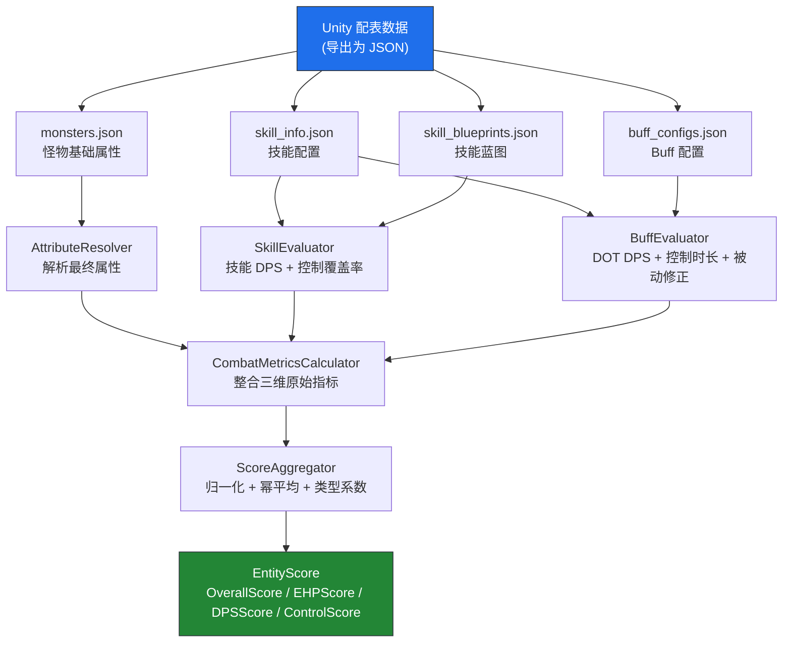

# Datum 评分系统 — 公式参考手册

> **版本**：v1.0 | **适用范围**：DatumPlatform 后端 + Unity 编辑器插件
>
> 本文档是面向**策划、程序、AI 分析工具**的技术参考，完整描述 Datum 评分系统的数学定义、计算流程和参数含义。

---

## 1. 系统概述

Datum 是一套**基于属性推演的怪物难度量化系统**，将游戏中怪物的原始数值（HP、防御、技能蓝图等）转换为可比较的归一化评分，用于：

- 横向比较不同怪物之间的相对强度
- 分析关卡的难度曲线和波次压力
- 为策划调整数值提供可量化依据
- 为关卡编辑器的自动怪物摆放提供评分依据

### 三个评分维度

| 维度 | 含义 | 代表能力 |
|------|------|----------|
| EHP | Effective Hit Points，等效生命值 | 怪物的生存耐久能力 |
| DPS | Damage Per Second，每秒伤害 | 怪物对玩家的输出威胁 |
| Control | 控制能力 | 怪物干扰/限制玩家行动的能力 |

---

## 2. 数据流与计算管线

---

## 3. 维度一：EHP（等效生命值）

### 3.1 基础 EHP

EHP 将防御减伤折算为"等效血量"。防御越高，实际受伤越少，等效血量越大。

防御减伤率：

$$\text{damageReduction} = \frac{\text{DEF}}{\text{DEF} + \text{baseline\_atk}}$$

基础 EHP：

$$\text{BaseEHP} = \frac{\text{HP}}{1 - \text{damageReduction}} = \text{HP} \times \frac{\text{DEF} + \text{baseline\_atk}}{\text{baseline\_atk}}$$

> $\text{baseline\_atk}$（默认 1000）代表玩家的标准攻击力，是折算的参考基准。

### 3.2 元素抗性修正

$$\text{avgRes} = \frac{\text{IceRes} + \text{FireRes} + \text{PoisonRes} + \text{EleRes}}{4}$$

$$\text{elementFactor} = 1 + \frac{\text{avgRes}}{10000}$$

> 抗性值单位为万分之一（10000 = 完全免疫）。

### 3.3 被动 Buff 修正

永久性被动 Buff（$\text{LastTime} = -1$）对 EHP 产生乘法修正：

$$\text{passiveModifier} = 1.3^{N_{\text{passive}}}$$

> 每个永久被动 Buff 给予 $\times 1.3$ 修正（涵盖免疫类/霸体类等）。

### 3.4 最终 EHP 与归一化

$$\text{EffectiveHP} = \text{BaseEHP} \times \text{elementFactor} \times \text{passiveModifier}$$

$$\text{EHP\_norm} = \frac{\text{EffectiveHP}}{\text{baseline\_ehp}}$$

> $\text{baseline\_ehp}$（默认 10000）为参考基准，$\text{EHP\_norm} > 1$ 表示强于基准强度。

---

## 4. 维度二：DPS（每秒伤害）

$$\text{DPS} = \text{SkillDPS} + \text{DotDPS}$$

### 4.1 技能 DPS

遍历怪物所有攻击技能，基于技能蓝图计算每技能的 DPS：

$$\text{damageRatio}_i = \frac{\sum_{hp} \text{DamagePerMyriad}_{hp}}{10000}$$

$$\text{cycleSec}_i = \frac{\text{ContinuousFrames}_i}{10} + \frac{\text{CooldownMs}_i}{1000}$$

$$\text{skillDPS}_i = \text{baseAttack} \times \frac{\text{damageRatio}_i}{\text{cycleSec}_i}$$

$$\text{SkillDPS} = \sum_i \text{skillDPS}_i$$

参数说明：

- $\text{DamagePerMyriad}$：打击点伤害系数（万分之一，10000 = 100% 攻击力一次）
- $\text{ContinuousFrames}$：技能动作总帧数（逻辑帧率固定 10fps）
- $\text{CooldownMs}$：技能冷却时间（毫秒）

### 4.2 DOT DPS

来自技能附带 Buff 的持续伤害效果：

$$\text{hitRate} = \frac{\text{BaseHitrate}}{10000}$$

**DOT Buff**（$\text{AttrValue2} > 0$，$\text{AttrValue8} > 0$，$\text{LastTime} > 0$）：

$$\text{damagePerTick} = \text{baseAtk} \times \frac{\text{AttrValue2}}{10000}$$

$$\text{tickCount} = \left\lfloor \frac{\text{LastTime}}{\text{AttrValue8}} \right\rfloor$$

$$\text{dotDPS} = \frac{\text{damagePerTick} \times \text{tickCount} \times \text{hitRate}}{\text{LastTime} / 1000}$$

**瞬时伤害 Buff**（$\text{AttrValue} > 0$，$\text{LastTime} > 0$）：

$$\text{burstDPS} = \frac{\text{baseAtk} \times \frac{\text{AttrValue}}{10000} \times \text{hitRate}}{\text{LastTime} / 1000}$$

### 4.3 总 DPS 与归一化

$$\text{TotalDPS} = \text{SkillDPS} + \text{DotDPS}$$

$$\text{DPS\_norm} = \frac{\text{TotalDPS}}{\text{baseline\_dps}}$$

> $\text{baseline\_dps}$（默认 300）为参考基准。$\text{DPS\_norm} = 0$ 是异常信号（通常意味着缺少技能蓝图数据）。

---

## 5. 维度三：Control（控制能力）

$$\text{Control} = \text{SkillControlScore} + \text{BuffControlScore}$$

### 5.1 技能控制

遍历技能蓝图的打击点，按控制效果强度加权：

$$\text{stagger}_{hp} = \begin{cases} 1.0 & \text{if CanAirborne or CanKnockDown (硬控)} \\ 0.3 & \text{if CanStiffness (软控)} \\ 0 & \text{otherwise} \end{cases}$$

$$\text{SkillControlScore} = \min\!\left(\sum_{hp} \text{stagger}_{hp} \times 0.2,\; 1.0\right)$$

> 控制覆盖率被限制在 $[0, 1]$（代表"每次攻击循环中的控制频率"）。

### 5.2 Buff 控制

来自技能附带的控制类 Buff（无伤害、有持续时间）：

$$\text{BuffControlScore} = \sum_{\text{buff}} \frac{\text{LastTime}_{\text{buff}}}{1000} \times \text{hitRate}_{\text{buff}}$$

> 判定条件：$\text{AttrValue} = 0$，$\text{AttrValue2} = 0$，$\text{LastTime} > 0$

### 5.3 总控制与归一化

$$\text{Control\_norm} = \frac{\text{SkillControlScore} + \text{BuffControlScore}}{\text{baseline\_control}}$$

> $\text{baseline\_control}$（默认 5000）量级较大，使 $\text{Control\_norm}$ 通常远小于 1，这是控制权重偏低的原因。

---

## 6. 综合评分聚合

### 6.1 加权幂平均（Power Mean）

三个维度通过加权幂平均聚合，$\alpha$ 参数控制聚合模式。

**当 $\alpha = 0$（默认）— 加权几何平均**：

$$M_0 = \exp\!\left(\frac{\sum_i w_i \ln x_i}{\sum_i w_i}\right) = \prod_i x_i^{\,w_i / \sum w}$$

**当 $\alpha \neq 0$ — 一般幂平均**：

$$M_\alpha = \left(\frac{\sum_i w_i \, x_i^\alpha}{\sum_i w_i}\right)^{1/\alpha}$$

> 几何平均（$\alpha=0$）的特性：**任何一维为 0，整体为 0**。适合要求三维均衡的场景。

### 6.2 类型系数

| 类型 | FoeType | 默认系数 |
|------|---------|----------|
| 普通怪 | 1 / 2 / 3 | $\times 1.0$ |
| 精英怪 | 5 | $\times 1.5$ |
| Boss | 4 | $\times 2.5$ |

### 6.3 最终综合评分

$$\text{OverallScore} = M_\alpha\!\left(\text{EHP\_norm},\, \text{DPS\_norm},\, \text{Control\_norm};\; w_1, w_2, w_3\right) \times \text{typeBonus}$$

默认权重（$w_1 = 0.4,\; w_2 = 0.4,\; w_3 = 0.2$）展开为：

$$\text{OverallScore} = \text{EHP\_norm}^{0.4} \times \text{DPS\_norm}^{0.4} \times \text{Control\_norm}^{0.2} \times \text{typeBonus}$$

---

## 7. 难度档位划分

档位阈值基于**全量评分的百分位数**自动划定：

| 分界线 | 百分位 | Tier 标签 |
|-------|--------|----------|
| $\text{Score} < P_{33}$ | 第 33 百分位 | `easy` |
| $P_{33} \le \text{Score} < P_{66}$ | 第 66 百分位 | `medium` |
| $P_{66} \le \text{Score} < P_{90}$ | 第 90 百分位 | `hard` |
| $\text{Score} \ge P_{90}$ | — | `boss` |

> 阈值随评分分布自动调整，重新校准权重后同步更新。
>
> **API**：`GET /api/difficulty-tiers` 返回当前阈值 + 每只怪物的 tier 标签。

---

## 8. 权重校准算法

### 8.1 问题定义

给定 $N$ 条主观评分样本，每条包含：
- $y_i$：策划主观评分（$1 \sim 10$）
- $\text{EHP\_norm}_i,\; \text{DPS\_norm}_i,\; \text{Control\_norm}_i$：归一化三维指标

目标：求权重 $(w_1, w_2, w_3)$ 和缩放因子 $k$，使得：

$$k \left(w_1 \cdot \text{EHP\_norm} + w_2 \cdot \text{DPS\_norm} + w_3 \cdot \text{Control\_norm}\right) \times 10 \;\approx\; y$$

### 8.2 最小二乘法求解

令 $\mathbf{X} \in \mathbb{R}^{N \times 3}$，$\mathbf{y}' = \mathbf{y} / 10$，$\boldsymbol{\beta} = [kw_1,\, kw_2,\, kw_3]^T$：

$$\boldsymbol{\beta} = (\mathbf{X}^T \mathbf{X})^{-1}\, \mathbf{X}^T \mathbf{y}'$$

> 使用 $3 \times 3$ 矩阵的**克拉默法则**求解（避免引入线性代数库）。

### 8.3 后处理

1. **非负约束**：$\beta_i = \max(\beta_i,\; 0)$
2. **提取缩放因子**：$k = \beta_1 + \beta_2 + \beta_3$
3. **权重归一化**：$w_i = \beta_i \,/\, k$

### 8.4 拟合质量

$$\hat{y}_i = k \left(w_1 \cdot \text{EHP}_i + w_2 \cdot \text{DPS}_i + w_3 \cdot \text{Control}_i\right) \times 10$$

$$R^2 = 1 - \frac{\sum_i (y_i - \hat{y}_i)^2}{\sum_i (y_i - \bar{y})^2} \qquad \text{MSE} = \frac{1}{N}\sum_i (y_i - \hat{y}_i)^2$$

| $R^2$ 值 | 评价 |
|----------|------|
| $\ge 0.9$ | 优秀，权重高度符合主观感受 |
| $0.7 \sim 0.9$ | 良好，可信赖 |
| $0.5 \sim 0.7$ | 一般，建议补充更多样本 |
| $< 0.5$ | 较差，需重新标注 |

### 8.5 标注建议

- **样本数量**：建议 8~15 条，覆盖简单/中等/困难三个档位
- **分布均匀**：不要全部选同类型怪物
- **锚点参照**：先设定 3 个参照怪（简单 $\approx 2$ 分、中等 $\approx 5$ 分、困难 $\approx 8$ 分），其余相对标注

---

## 9. 基准参数说明

所有基准参数均可在 `weight_config.json` 中配置：

| 参数 | 默认值 | 含义 |
|------|--------|------|
| `baseline_atk` | 1000 | 玩家标准攻击力，用于 EHP 折算 |
| `baseline_def` | 500 | 参考防御值（用于基准 EHP 推算） |
| `baseline_hp` | 5000 | 参考 HP（用于基准 EHP 推算） |
| `baseline_ehp` | 10000 | EHP 归一化基准 |
| `baseline_dps` | 300 | DPS 归一化基准 |
| `baseline_control` | 5000 | Control 归一化基准 |
| `survival_weight` | 0.4 | EHP 维度权重 |
| `damage_weight` | 0.4 | DPS 维度权重 |
| `control_weight` | 0.2 | Control 维度权重 |
| `power_mean_alpha` | 0 | 幂平均指数（0 = 几何均值） |
| `normal_bonus` | 1.0 | 普通怪类型系数 |
| `elite_bonus` | 1.5 | 精英怪类型系数 |
| `boss_bonus` | 2.5 | Boss 类型系数 |

---

## 10. 异常检测规则

系统对以下情况标记异常：

| 异常类型 | 判定条件 | 可能原因 |
|---------|---------|---------|
| 生存/输出失衡 | $\text{EHP\_norm} / \text{DPS\_norm} > 10$ | 配置为纯坦克型但无攻击技能数据 |
| 输出/生存失衡 | $\text{DPS\_norm} / \text{EHP\_norm} > 10$ | 配置为纯输出型但 HP 极低 |
| 控制满值 | $\text{Control\_norm} \ge 1.0$ | 控制技能配置过多或 baseline_control 偏低 |
| DPS 为零 | $\text{DPS\_norm} = 0$ | 缺少技能蓝图数据 |

---

## 11. 关卡难度聚合

### 11.1 波次难度

每个波次（Wave）的难度基于该波次出现怪物的评分总和：

$$\text{WaveDifficulty} = \sum_i \text{OverallScore}_i \times \text{count}_i$$

### 11.2 关卡难度曲线

关卡维度按时间轴统计每个时刻存活的怪物总评分：

$$D(t) = \sum_{\{i\,|\,t_i \le t < t_i + L\}} \text{OverallScore}_i$$

> $L$（默认 30 秒）为怪物预计存活时间，可在 API 请求中覆盖。

### 11.3 关卡指标

| 指标 | 含义 |
|------|------|
| $\text{PeakDifficulty}$ | 难度曲线的最大值 |
| $\text{AvgDifficulty}$ | 难度曲线的时间平均值 |
| $\text{WaveCount}$ | 波次总数 |
| $\text{MonsterCount}$ | 怪物总数 |
| $\text{DifficultyVariance}$ | 难度方差（衡量曲线平稳性） |

---

## 附录：FoeType 编码

| FoeType 值 | 类型名称 |
|-----------|---------|
| 1 | 普通怪 |
| 2 | 远程怪 |
| 3 | 特殊怪 |
| 4 | Boss |
| 5 | 精英怪 |

---

*文档由 Datum Platform 维护，与代码实现保持同步。*
*源码路径：`DatumCore/` | 相关配置：`datum_export/weight_config.json`*
