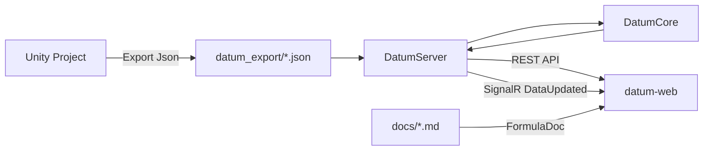

<div align="center">


<h1>DatumPlatform</h1>

**面向 Unity 导出数据的游戏数值评估平台**

评分看板、权重校准、模板一致性、关卡难度曲线、实时热更新、AI 辅助分析

<p>
  <a href="https://github.com/zgx197/DatumPlatform/actions/workflows/build-portable-exe.yml">
    
  </a>
</p>

<p>
  
  
  
  
  
  
  
</p>

</div>

| 维度 | 说明 |
| --- | --- |
| 核心定位 | 用 Unity 导出的 JSON 数据驱动数值分析，把“数据加载、评分计算、可视化、校准、解释”串成一条可迭代链路 |
| 架构特征 | `datum-web`、`DatumServer`、`DatumCore` 三层解耦，其中 `DatumCore` 为 `netstandard2.1`，便于与 Unity 侧共享 |
| 实时能力 | `FileWatcherService` 监听 `datum_export/*.json`，通过 SignalR 推送 `DataUpdated`，前端自动刷新查询结果 |
| 适用对象 | 数值策划、战斗策划、技术策划、工具开发、平衡性分析和项目调试人员 |

> 如果你第一次打开这个仓库，建议先读“快速导航”和“阅读建议”，再进入后面的模块细节。

<a id="quick-links"></a>
## 快速导航

- [这是什么](#what)
- [功能亮点](#features)
- [运行环境](#environment)
- [怎么启动](#getting-started)
- [CI 与下载](#ci-download)
- [阅读建议](#reading-guide)
- [核心分层与数据流](#architecture)
- [关键目录](#repo-map)
- [数据格式](#data-files)
- [打包分发](#build)

<a id="what"></a>
## 这是什么

`DatumPlatform` 是一个围绕 Unity 导出数据构建的数值评估工作台。它把 `datum_export/` 中的怪物、技能、Buff、模板、关卡等 JSON 数据加载到后端，通过 `DatumCore` 做评分与聚合，再交给 React 前端做可视化分析、参数校准和 AI 辅助解释。

这个仓库最有价值的地方不只是“把分数算出来”，而是把数值迭代中最常见的几个环节放在了同一个闭环里：

- 看全量怪物评分，快速找异常点
- 调权重并保存样本，校准评分模型
- 看模板一致性，发现缩放或变种问题
- 看关卡难度曲线，验证节奏和峰值
- 用 AI 助手直接查询系统数据，辅助解释现象

<a id="features"></a>
## 功能亮点

| 能力 | 说明 |
| --- | --- |
| 评分看板 `ScoreDashboard` | 展示全量怪物综合评分，支持 EHP / DPS / Control 分解、异常标记、关卡筛选、详情抽屉 |
| 权重校准 `WeightCalibration` | 维护主观样本，执行最小二乘法校准，输出权重、`R²`、`MSE` 和解释文本 |
| 模板分析 `TemplateAnalysis` | 以模板聚类方式查看变种评分、缩放趋势和一致性偏差 |
| 健康报告 `HealthReport` | 汇总全局异常怪物与模板问题，给出整体健康度和跨模板对比 |
| 关卡视图 `LevelView` | 分析总难度、峰值难度、波次详情、元素分布和难度弹性，支持存活时间滑块联动重算 |
| AI 助手 `AiChatDrawer` | 支持流式输出、Markdown、KaTeX、Mermaid，并内置 12 个数据查询 Tool Functions |
| 实时热更新 | JSON 数据变化后自动重载后端数据，并通过 `/hubs/datum` 推送前端刷新 |
| 文档系统 `FormulaDoc` | 从 `docs/` 目录加载 Markdown 文档，支持 GFM、KaTeX 和 Mermaid 渲染 |
| 版本更新提示 | `UpdateController` 提供版本检测与本地更新入口，前端头部显示更新 Banner |

<a id="environment"></a>
## 运行环境

- `.NET 9 SDK`
- `Node.js` 与 `npm`
- Unity 项目导出的 JSON 数据目录 `datum_export/`
- 推荐在 Windows + PowerShell 下使用 `dev.ps1`
- 构建脚本支持 `win-x64`、`osx-arm64`、`linux-x64`

开发默认地址：

- Web: `http://localhost:5173`
- API: `http://localhost:7000`
- SignalR Hub: `http://localhost:7000/hubs/datum`

<a id="getting-started"></a>
## 怎么启动

### 1. 准备数据

在 Unity 项目中导出 JSON 到本仓库的 `datum_export/`，或指定任意自定义导出目录。

### 2. 一键启动

```powershell
.\dev.ps1

# 指定数据目录
.\dev.ps1 -Data "D:\work\DatumPlatform\datum_export"

# 仅启动后端
.\dev.ps1 -BackendOnly

# 仅启动前端
.\dev.ps1 -FrontendOnly

# 跳过后端编译
.\dev.ps1 -SkipBuild
```

`dev.ps1` 会自动完成这些事：

1. 清理旧的前后端进程
2. 构建 `DatumServer`
3. 启动后端并检查 `/api/health`
4. 启动 `datum-web` 开发服务器
5. 同步 `docs/Datum_Formula_Reference.md` 到前端静态目录
6. 自动打开 `http://localhost:5173/levels`

### 3. 手动启动

后端：

```powershell
cd .\DatumServer
dotnet run -- --data "D:\work\DatumPlatform\datum_export"
```

前端：

```powershell
cd .\datum-web
npm install
npm run dev
```

<a id="ci-download"></a>
## CI 与下载

CI 工作流：

- GitHub Actions: `Build Portable EXE`
- 工作流地址: `https://github.com/zgx197/DatumPlatform/actions/workflows/build-portable-exe.yml`
- 触发方式: `push main`、`pull_request -> main`、推送 `v*` 标签、手动触发

如何下载构建产物：

1. 打开仓库的 `Actions` 页面。
2. 进入最新一次 `Build Portable EXE` 运行记录。
3. 在页面底部的 `Artifacts` 区域下载 zip 包。

如何下载正式发布包：

1. 打开仓库的 `Releases` 页面。
2. 推送与 `DatumServer/DatumServer.csproj` 中 `<Version>` 一致的标签，例如版本是 `1.0.0` 时推送 `v1.0.0`。
3. CI 会自动创建或更新 Release，并上传对应 zip 附件。

命名规则：

- 版本号来源：`DatumServer/DatumServer.csproj` 的 `<Version>`
- Release 名称：`DatumPlatform v<Version>`
- 构建产物：`DatumPlatform-v<Version>-win-x64.zip`
- 发布标签：`v<Version>`

<a id="reading-guide"></a>
## 阅读建议

| 你现在最关心什么 | 建议先看 |
| --- | --- |
| 这个项目整体在做什么 | “这是什么” + “核心分层与数据流” |
| 前端有哪些页面 | `datum-web/src/routes/AppRoutes.tsx` |
| 前端怎么调后端数据 | `datum-web/src/api/datum.ts` |
| 后端暴露了哪些接口 | `DatumServer/Controllers/` |
| 数据变了为什么页面会自动刷新 | `DatumServer/Services/FileWatcherService.cs` + `datum-web/src/App.tsx` |
| 评分、模板、关卡逻辑在哪里 | `DatumCore/` |
| AI 助手能查什么 | `datum-web/src/services/aiTools.ts` |
| 公式和设计文档在哪里 | `docs/` + `datum-web/src/pages/FormulaDoc/index.tsx` |
| 如何本地打包给别人运行 | “打包分发” + `build.ps1` |

<a id="architecture"></a>
## 核心分层与数据流

理解这个仓库，最简单的方式是把它看成三层：

| 层 | 负责什么 | 对应目录 |
| --- | --- | --- |
| 数据入口层 | 承接 Unity 导出的 JSON 数据和配套文档 | `datum_export/`、`docs/` |
| 服务与计算层 | 加载数据、计算评分、聚合模板与关卡结果、提供 REST / SignalR 接口 | `DatumServer/`、`DatumCore/` |
| 展示与交互层 | 页面导航、图表可视化、参数校准、AI 助手、调试面板 | `datum-web/` |



这条链路里有两个很关键的设计点：

- `DatumCore` 不依赖 Unity，方便在服务端单独计算，也方便与 Unity 项目共享核心算法
- 后端既提供 REST 数据读取，也负责监听文件变化并推送前端刷新，减少手动重启和重复操作

### 页面地图

| 路由 | 页面 | 用途 |
| --- | --- | --- |
| `/` | Score Dashboard | 看全量怪物评分、异常、详情 |
| `/templates` | Template Analysis | 看模板一致性与缩放趋势 |
| `/levels` | Level View | 看关卡难度、波次、元素分布 |
| `/calibration` | Weight Calibration | 调样本、跑校准、更新权重 |
| `/health` | Health Report | 看整体健康度与跨模板问题 |
| `/docs` | Formula Doc | 阅读系统文档与公式参考 |
| `/settings` | Settings | 管理 AI 配置、快捷键、Prompt 规则 |

### 接口与实时机制

当前前端主要通过这些接口工作：

- `GET /api/health`
- `GET /api/scores`、`POST /api/scores/recalc`
- `GET /api/weights`、`PUT /api/weights`
- `GET /api/templates`
- `GET /api/calibration/samples`、`PUT /api/calibration/samples`、`POST /api/calibration/run`
- `GET /api/levels/structures`、`GET /api/levels/metrics`
- `GET /api/difficulty-tiers`
- `GET /api/update/check`、`POST /api/update/apply`

实时更新链路：

1. `DatumServer` 启动时加载 `datum_export/`
2. `FileWatcherService` 监听 `*.json`
3. 数据变化后重新执行加载
4. 通过 `/hubs/datum` 广播 `DataUpdated`
5. 前端在 `App.tsx` 中失效相关 React Query 缓存并重新拉取数据

<a id="repo-map"></a>
## 关键目录

```text
DatumPlatform/
├── datum-web/                  React + TypeScript + Ant Design + ECharts
│   ├── src/pages/              评分、模板、关卡、校准、健康、设置、文档页面
│   ├── src/components/         AI 抽屉、调试面板、更新提示、Mermaid 组件
│   ├── src/services/           AI 配置、AI Tools、快捷键、Prompt 规则、UI 偏好
│   └── src/api/                后端 REST API 客户端
├── DatumServer/               ASP.NET Core 9 服务端
│   ├── Controllers/           HTTP API
│   ├── Services/              数据加载、文件监听
│   ├── Hubs/                  SignalR Hub
│   └── wwwroot/               前端构建产物
├── DatumCore/                 评分与聚合核心算法
│   ├── Aggregator/            综合评分聚合
│   ├── Calibrator/            权重校准
│   ├── Metrics/               指标计算
│   ├── Provider/              JSON 数据提供者
│   ├── Template/              模板发现与评估
│   └── LevelAggregator/       关卡难度聚合
├── datum_export/              Unity 导出的 JSON 数据
├── docs/                      设计文档、公式参考、环境说明
├── dev.ps1                    本地开发一键启动脚本
└── build.ps1                  单文件发布脚本
```

<a id="data-files"></a>
## 数据格式

`datum_export/` 中常见的文件包括：

- `monsters.json`: 怪物基础数据
- `skill_info.json`: 技能基础配置
- `skill_blueprints.json`: 技能蓝图与命中点
- `buff_configs.json`: Buff 配置
- `weight_config.json`: 当前评分权重
- `calibration.json`: 主观校准样本
- `templates.json`: 模板注册与聚类结果
- `monster_scores.json`: 预计算评分结果
- `level_structure.json`: 关卡结构、触发器和波次信息

字段约定：

- Unity 导出与后端反序列化主要使用 `snake_case`
- 前端 TypeScript 类型和后端 DTO 尽量保持同构
- 避免同一条链路里混用驼峰和下划线命名

<a id="build"></a>
## 打包分发

```powershell
.\build.ps1

# 指定运行时
.\build.ps1 -Runtime osx-arm64
.\build.ps1 -Runtime linux-x64

# 跳过前端构建
.\build.ps1 -SkipFrontend
```

`build.ps1` 会：

1. 构建前端并输出到 `DatumServer/wwwroot/`
2. 还原 NuGet 包
3. 发布单文件自包含可执行文件
4. 复制或生成 `datum_export/`

默认产物位于：

- `publish/win-x64/DatumServer.exe`

如果 `datum_export/` 不存在，脚本会生成占位 JSON，方便先验证程序链路，再替换为真实项目数据。

## 技术栈

- 前端：React 18、TypeScript、Ant Design 5、ECharts、TanStack Query、Zustand
- AI 与文档渲染：React Markdown、KaTeX、Mermaid
- 后端：ASP.NET Core 9、SignalR、System.Text.Json
- 核心计算：C#、`netstandard2.1`
- 构建：Vite、`dotnet publish`

## 相关文档

- `docs/Datum_Platform_Design.md`
- `docs/Datum_Design.md`
- `docs/Datum_Formula_Reference.md`
- `docs/EnvironmentSetup.md`
- `docs/ProjectSystems_Reference.md`
